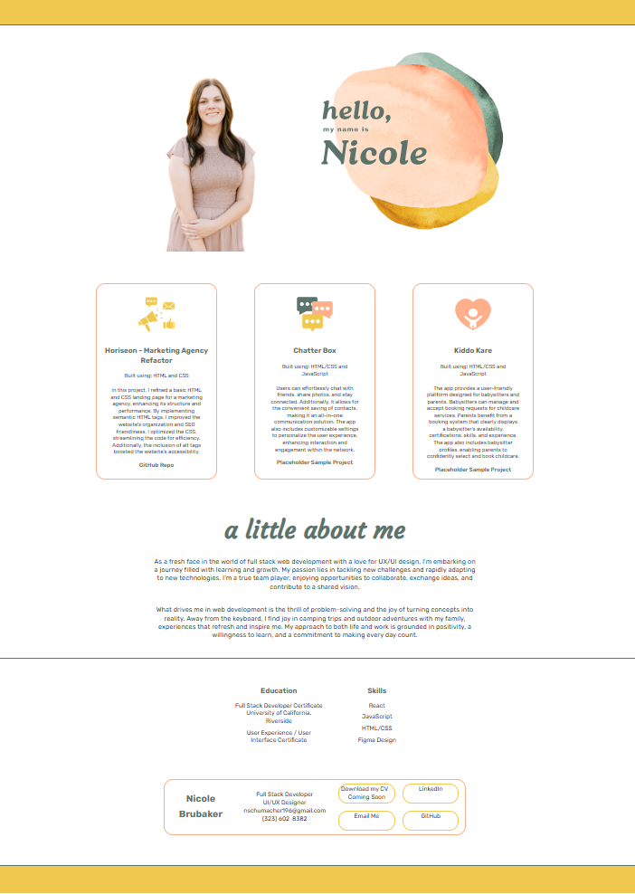

# Nicole Brubaker - Portfolio

## Overview 

This is my portfolio website. The site includes a feature section of three projects I have built. Please note on the project section, two are coming soon (placeholder cards) and the first one is a homework assignment as it is all I have worked on to provide a GitHub link at the moment. More to come. My site also shows some information about me, my education, and my skills. At the bottom of the page you will find contact information to get in touch if desired.

## Built With
Currently all code is written using HTML and CSS.

## License

MIT (https://choosealicense.com/licenses/mit/)

## Project Status & Future Features

I am very proud of the hard work I put in on this.
This is my very first website build from scratch, and I am happy with how it came out. That said, I do hope to add improvements in the future and expand on the work I have started.

This is a work in progress. Some items are just placeholders for future iterations (more projects to come, and a downloadable CV to come). 

GitHub repo: https://github.com/NicoleBrubaker/Portfolio-NicoleBrubaker
Live site: https://nicolebrubaker.github.io/Portfolio-NicoleBrubaker/

